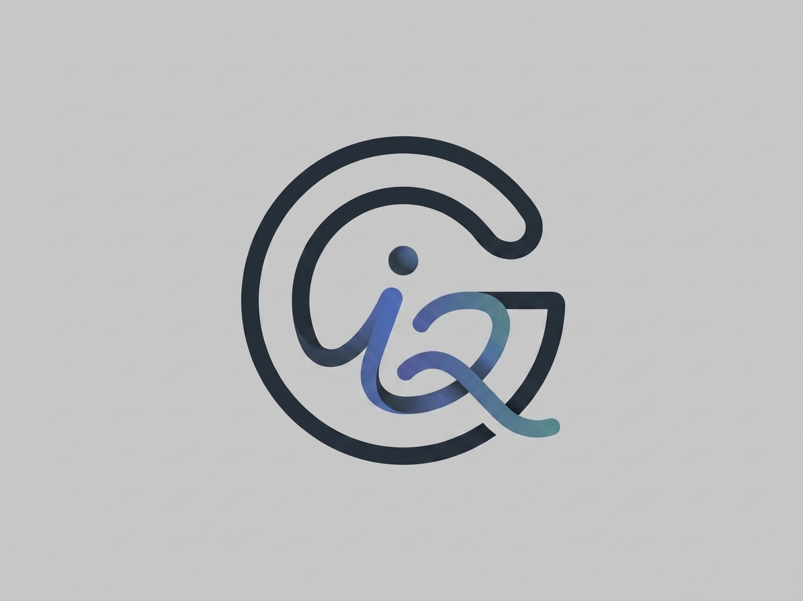

# GraphIQ

Local code intelligence for agents and developers.

GraphIQ indexes a repository into a structural graph of symbols, files, calls,
imports, constants, type flow, and error surfaces. It gives agents a fast local
map of how code is connected without sending source to a remote service.

<p align="center">
  <picture>
    <source media="(prefers-color-scheme: dark)" srcset="docs/assets/graphiq-logo-dark.png">
    <source media="(prefers-color-scheme: light)" srcset="docs/assets/graphiq-logo-light.png">
    
  </picture>
</p>

<p align="center">
  <a href="https://github.com/aaf2tbz/graphiq/releases"></a>
  <a href="https://github.com/aaf2tbz/graphiq/blob/main/LICENSE"></a>
  <a href="docs/benchmarks.md"></a>
</p>

## Why GraphIQ

Substring search finds matching text. GraphIQ finds related code.

Ask for `rate limit middleware` and GraphIQ can rank `rateLimitMiddleware`, then
connect it to `TokenBucket`, `ThrottleConfig`, `checkRateLimit`, imported
constants, callers, and nearby files. The result is local, explainable search
that works well for agents because the graph carries context with the match.

GraphIQ is:

- Local-first: no network calls and no remote model required.
- Structural: symbols, calls, imports, constants, files, and graph edges.
- Fast: a single SQLite index plus cached graph artifacts.
- Agent-ready: CLI, MCP server, desktop app, Signet plugin, and harness setup.

## Install

### Homebrew

```bash
brew tap aaf2tbz/graphiq
brew install graphiq
```

### Install Script

```bash
curl -fsSL https://raw.githubusercontent.com/aaf2tbz/graphiq/main/install.sh | bash
```

### From Source

```bash
git clone https://github.com/aaf2tbz/graphiq.git
cd graphiq
cargo build --release
```

Requirements: Rust 1.75 or newer, a C compiler for tree-sitter grammar builds,
and `pkg-config`. SQLite is bundled.

## Quickstart

```bash
graphiq index /path/to/project
graphiq search "rate limit middleware"
graphiq context rateLimitMiddleware
graphiq impact --project /path/to/project
```

Wire GraphIQ into an agent harness:

```bash
graphiq setup --project /path/to/project
graphiq setup --harness codex
```

`setup` configures MCP servers with temp-backed indexes by default so large
indexes do not land in the project checkout. Use `--persistent` when you
explicitly want a project-local `.graphiq` database.

Supported harnesses include Claude Code, Claude Desktop, OpenCode, Codex CLI,
Cursor, Windsurf, Gemini CLI, Hermes Agent, and Aider.

## Desktop App

The desktop app gives you a visual index browser, topology view, connector
status, and project management.

```bash
cd apps/desktop
npm install
npm run dev
```

The desktop app follows the active Signet session workspace when Signet writes
`$SIGNET_WORKSPACE/.daemon/graphiq/state.json`. Active session indexes are
sorted first and marked in the project selector.

## Agent And MCP Usage

Run the MCP server against a project:

```bash
graphiq-mcp /path/to/project --watch
```

The MCP server auto-binds supported provider workspace roots, lazily builds its
index on first search, and detects/recreates corrupted or wrong-project
databases automatically.

Common MCP tools:

| Tool | Use |
|---|---|
| `briefing` | Project overview and starting context |
| `search` | Ranked symbol search with structural scoring |
| `context` | Source plus graph neighborhood for a symbol |
| `blast` | Forward or backward impact radius |
| `impact` | Git diff impact report |
| `topology` | Local graph and subsystem structure |
| `constants` | Numeric and string constant lookup |
| `status` | Index stats and health |
| `doctor` | Artifact validation and repair guidance |
| `upgrade_index` | Rebuild stale graph artifacts |
| `index` | Full reindex (only when empty/corrupt) |
| `clear` | Delete the index, leaving a fresh empty database |
| `sync` | Verify harness attach + write the graphiq registry |

## What Gets Indexed

| Layer | Examples |
|---|---|
| Symbols | functions, methods, classes, interfaces, traits, structs, enums |
| Structure | calls, imports, references, containment, type flow, constants |
| Context | comments, signatures, file paths, sibling symbols, error surfaces |
| Maintenance | dead code, blast radius, topology, index health |

Dependency lockfiles and other generated data files (`package-lock.json`,
`Cargo.lock`, `pnpm-lock.yaml`, `yarn.lock`, `go.sum`, and oversized JSON/YAML/TOML
blobs) are **file-tracked** for freshness but **never symbol-extracted**, so they
can't silently dominate the graph with thousands of low-value keys. Wipe an index
any time with `graphiq clear` (or the MCP `clear` tool).

GraphIQ currently parses TypeScript, TSX, JavaScript, JSX, Rust, Python, Go,
Java, C, C++, Ruby, YAML, TOML, JSON, HTML, and CSS. It also tracks many
additional file types at file level, including Markdown, Shell, SQL, Swift,
C#, PHP, Lua, Dart, Scala, Haskell, Elixir, Zig, GraphQL, Protobuf, XML, SCSS,
CMake, Dockerfile, Makefile, and Meson files.

## How It Works

```text
query
  -> query family router
  -> BM25 lexical seeds
  -> graph expansion through calls/imports/constants/neighbors
  -> structural aliases and family-specific scoring
  -> ranked symbols with source-backed context
```

The core pattern is simple: BM25 retrieves likely candidates quickly, then the
code graph reranks them with structural evidence.

Read more in [How GraphIQ works](docs/how-graphiq-works.md).

## Performance

Current v3.1 benchmark data covers 300 queries across signetai, esbuild, and
tokio. Full methodology is in [Benchmarks](docs/benchmarks.md).

| Codebase | GraphIQ NDCG@10 | GraphIQ MRR@10 |
|---|---:|---:|
| signetai | 0.286 (+100% vs grep) | 0.450 (+213% vs grep) |
| esbuild | 0.318 (+59% vs grep) | 0.551 (+280% vs grep) |
| tokio | 0.192 (-1% vs grep) | 0.411 (+25% vs grep) |
| Overall | 0.265 (+48% vs grep) | 0.471 (+128% vs grep) |

Typical index size for a roughly 20K-symbol codebase is about 6.5 MB. Warm
in-process search is designed for microsecond-scale graph traversal after the
index is loaded.

### Background Indexing

Foreground CLI indexing keeps the full source-token window for maximum recall.
Background indexing can use a lower-memory profile:

```bash
GRAPHIQ_INDEX_MODE=background graphiq index /path/to/project
```

In background mode GraphIQ reduces CPU-resident source tokenization and keeps
the existing GPU compute path available when built with the `gpu` feature. You
can override the source window with `GRAPHIQ_SOURCE_TERM_LIMIT`.

### CPU / Load Control

The long-running MCP daemon (`graphiq-mcp`) honors CPU caps so background
sessions stay light:

- `GRAPHIQ_MAX_THREADS=<n>` — max CPU threads for indexing/search (highest
  priority).
- `RAYON_NUM_THREADS=<n>` — same effect, standard rayon variable.
- In session/background mode (`--ephemeral` or `--session-id`) the default is
  capped to 4 threads even without these variables, so a harness-spawned daemon
  won't peg every core while warming an index. Foreground indexing still uses
  all cores.

```bash
GRAPHIQ_MAX_THREADS=2 graphiq-mcp /path/to/project
```

## Development

```bash
cargo fmt
cargo test
cargo run -p graphiq-cli -- index .
cargo run -p graphiq-cli -- search "query family router"
```

Desktop development:

```bash
cd apps/desktop
npm install
npm run dev
npm run package
```

Packaged desktop builds are written to `apps/desktop/release/`.

## Docs

- [How GraphIQ works](docs/how-graphiq-works.md)
- [Benchmarks](docs/benchmarks.md)
- [Research notes](docs/research.md)
- [Signet plugin](docs/signet-plugin.md)
- [Supported harnesses](docs/supported-harnesses.md)

## Agent Skill

GraphIQ is available as an installable agent skill:

```bash
npx skills add aaf2tbz/graphiq
```

## Uninstall

```bash
curl -fsSL https://raw.githubusercontent.com/aaf2tbz/graphiq/main/install.sh | bash -s -- uninstall
```

## License

MIT
